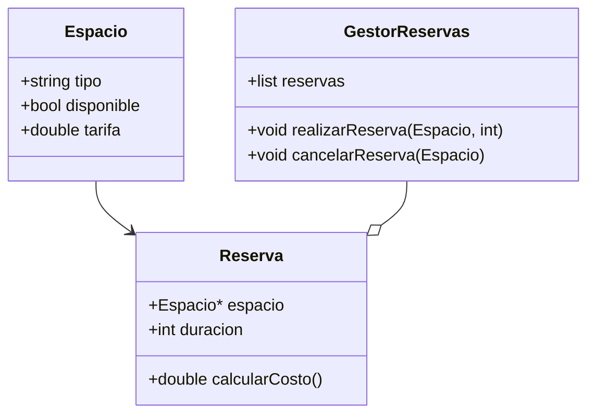
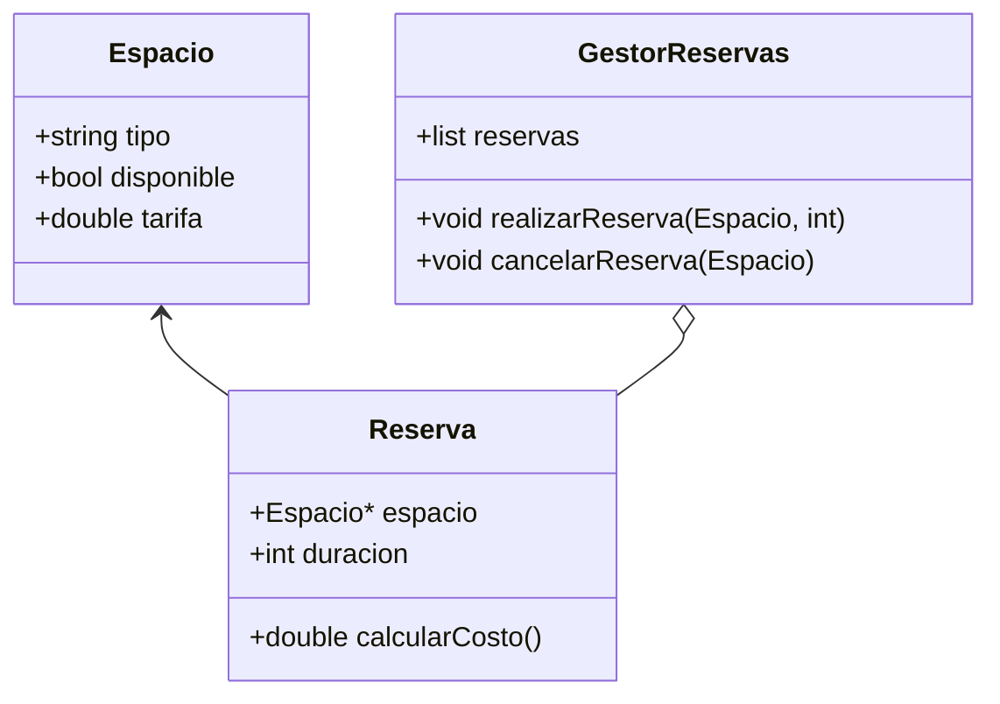
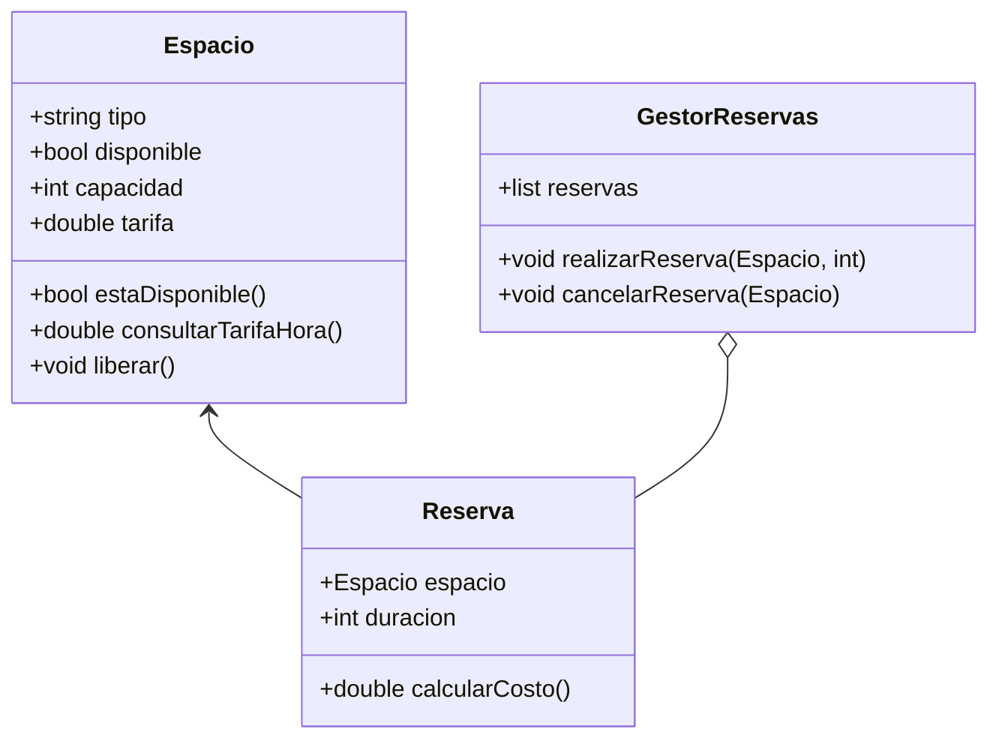

# 4.PracticaDiseno Codificacion Cpp

## A. Identificación de errores en un diseño
### Sistema de Gestión de Reservas para Espacios de Coworking

#### 1️⃣ Título del ejercicio
**"Sistema de Gestión de Reservas para Espacios de Coworking"**

#### 2️⃣ Introducción al problema
En el año 2025, con el auge del teletrabajo y el crecimiento de los espacios de coworking, muchas pequeñas empresas y trabajadores independientes necesitan un sistema eficiente para gestionar la reserva de espacios de trabajo.

Un coworking ofrece múltiples tipos de espacios: oficinas privadas, salas de reuniones y escritorios compartidos. Se busca un sistema que permita consultar la disponibilidad de espacios, hacer reservas y calcular el costo total de su uso.

Este sistema contribuye a los **ODS 8 (Trabajo decente y crecimiento económico)** y **ODS 9 (Industria, Innovación e Infraestructura)** al optimizar el uso de recursos y facilitar nuevas formas de trabajo.

#### 3️⃣ Descripción detallada del sistema

El sistema debe gestionar:

- **Los espacios de trabajo**, que tienen un tipo, un identificador único, una capacidad máxima, un estado de disponibilidad y una tarifa por hora.
- **Las reservas**, donde se selecciona un espacio, se indica la cantidad de horas a utilizar y se obtiene el costo total.

El sistema debe permitir:
✅ **Consultar la disponibilidad de un espacio de trabajo** se muestran los que no esten reservados.
✅ **Realizar reservas**, registrando el espacio y la duración.
✅ **Calcular el costo total de una reserva**, multiplicando las horas reservadas por la tarifa del espacio. Se muestra al usuario cuando se reserva
✅ **Cancelar reservas**, liberando el espacio reservado.
✅ **Liberar reservas**, lo hace al administrador manualmente cuando el usuario libera la sala

### ACTIVIDAD: Diseños propuestos
> Para cada diseño identificar los errores, si los hay. Proponer una solución corregida

##### Diseño uno

##### Diseño dos

##### Diseño tres

## B. Ejercicios de Diseño y codificación
A partir de los siguientes enunciados creen el diagrama de clases y luego la implementación de las clases en C++. 

### Requisitos de implementación

- **Antes de programar, diseñar un diagrama UML** con las clases y relaciones en formato **Mermaid**.
- **Usar `std::list`** para manejar las asociaciones de 1 a muchos.
- **Probar las funcionalidades en `main()`**, asegurando que se puedan hacer los escenarios propuestos.
- **Subir el código al repositorio de GitHub Classroom**, incluyendo el diagrama UML en `README.md'. 

### Ejercicio 1 Recicla y Gana: Sistema de Gestión de Reciclaje Comunitario

#### 1️⃣ Título del ejercicio
**"Recicla y Gana: Gestión de un Centro de Reciclaje Comunitario"**

#### 2️⃣ Introducción al problema
En el año 2025, muchas ciudades han implementado sistemas de incentivos para fomentar el reciclaje entre sus habitantes. Un pequeño municipio ha decidido modernizar su centro de reciclaje comunitario permitiendo que los ciudadanos entreguen materiales reciclables y acumulen puntos que pueden canjear por descuentos en tiendas locales o en el transporte público.

Cada persona puede llevar diferentes tipos de residuos reciclables (papel, plástico, vidrio, metales) y recibir puntos según el peso entregado. Los residuos son clasificados y registrados por los empleados del centro. Para hacer más eficiente el proceso, se necesita un sistema que registre los recicladores, los materiales entregados y calcule los puntos obtenidos.

Este sistema busca fomentar el reciclaje y la economía circular, contribuyendo al **ODS 12 (Producción y Consumo Responsable)** y al **ODS 11 (Ciudades y Comunidades Sostenibles)**.

#### 3️⃣ Descripción detallada del sistema

En el sistema participan diferentes actores:

- **Los ciudadanos**, quienes pueden registrarse en el programa de reciclaje, entregar materiales reciclables y consultar sus puntos acumulados.
- **Los empleados del centro de reciclaje**, encargados de registrar las entregas de materiales y calcular los puntos obtenidos.

El sistema debe permitir:
✅ **Registrar nuevos ciudadanos** con un identificador único, nombre y teléfono.
✅ **Registrar la entrega de materiales** reciclables con información sobre el tipo de material y su peso en kilogramos.
✅ **Calcular los puntos obtenidos**, donde cada tipo de material tiene una equivalencia en puntos por kilogramo (ejemplo: 1 kg de plástico = 5 puntos, 1 kg de vidrio = 2 puntos).
✅ **Consultar los puntos acumulados** por cada ciudadano.
✅ **Permitir que los ciudadanos canjeen puntos**, descontando del total acumulado y registrando el canje.

#### 4️⃣ Ejemplo de uso

##### 📌 Escenario 1: Registro y entrega de materiales
Ana Pérez se inscribe en el programa de reciclaje. Luego, lleva al centro de reciclaje 3 kg de plástico y 2 kg de vidrio.
- El sistema registra su entrega.
- Se calculan los puntos:
  - **3 kg de plástico → 3 × 5 = 15 puntos**
  - **2 kg de vidrio → 2 × 2 = 4 puntos**
  - **Total de puntos obtenidos: 19**
- Ahora Ana tiene **19 puntos** en su cuenta.

##### 📌 Escenario 2: Consulta de puntos y canje
Ana consulta su saldo de puntos y decide canjear 10 puntos por un descuento en el transporte público.
- Se verifica que tiene puntos suficientes.
- Se realiza el canje y su saldo se actualiza a **9 puntos**.

##### 📌 Escenario 3: Otra entrega de materiales
Ana regresa al centro y entrega **5 kg de metal (4 puntos por kg)**.
- Se calcula: **5 × 4 = 20 puntos**
- Su saldo aumenta a **29 puntos** (9 anteriores + 20 nuevos).

### Ejercicios adicionales sugeridos
* Modificar el sistema para permitir la eliminación de ciudadanos.
* Implementar un sistema de reportes para visualizar los materiales más reciclados.
* Agregar la opción de modificar la cantidad de puntos asignados a cada tipo de material.

